# TamaPoke

[](https://dylanpdao.github.io/TamaPoke/web/)
[](https://makerworld.com/es/models/2937822-tamapoke-a-pokemon-pokeball-tamagotchi)


[](https://github.com/DylanPDao/TamaPoke/stargazers)

A gen-1-Pokémon-inspired tamagotchi for the
**Waveshare ESP32-S3-Touch-AMOLED-1.75** (round 466×466 AMOLED, CO5300 driver
over QSPI, CST9217 touch over I2C). Raise any of the 386, evolve it, train it
and complete them all (shinies included).

> ### 🙏 This is a fork of [**socquique/TamaPoke**](https://github.com/socquique/TamaPoke) by **Quique Tortosa**
>
> Quique wrote the original TamaPoke — the firmware, the sprite pipeline, the
> six-language UI, the web installer, the whole thing. This fork builds on that
> work; it did not start it. If you like this, go **[star the
> original](https://github.com/socquique/TamaPoke)**.
>
> Original: MIT © 2026 Quique Tortosa. Changes in this fork are MIT on the same
> terms.

> **Personal, non-commercial fan project.** Code is MIT; the sprites are from
> PMD SpriteCollab (CC BY-NC, Pokémon © Nintendo/Game Freak), and the 3D case is
> CC BY-NC-SA. See **[License](#license)** and **Credits**.

🔴 **3D-printed Pokéball case + print profiles → [on MakerWorld](https://makerworld.com/es/models/2937822-tamapoke-a-pokemon-pokeball-tamagotchi)** · flash it in your browser → **[web installer](https://dylanpdao.github.io/TamaPoke/web/)**

## Screens

All shots are straight off the 466x466 round panel, rendered headlessly by the
emulator (`tools/emu/tamapoke-emu --shot <name>`), so they are exactly what the
hardware draws.

### Starting out

| Pick a region | ...then its starter | Johto's three |
|---|---|---|
| 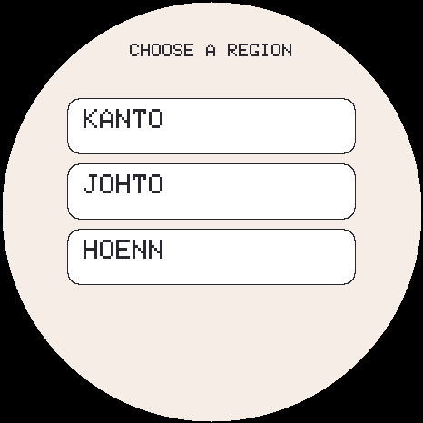 | 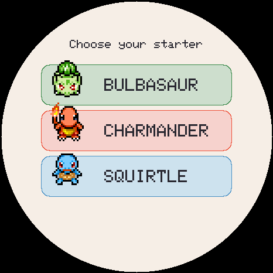 |  |

A new game asks which region you are playing before it asks which creature you
want. The choice sets both: you pick from that region's three starters, and it
becomes where your eggs come from afterwards (changeable later on the egg's
region pill). Existing saves never see this screen -- it only appears when the
Pokedex is empty.

### Raising one

| Your creature | Its egg | Moves it knows |
|---|---|---|
| 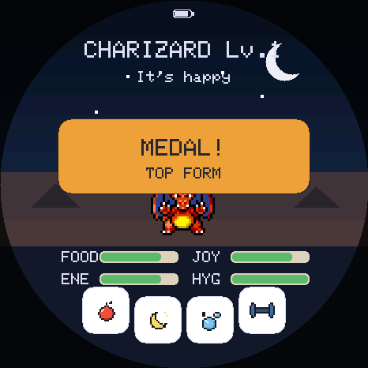 |  | 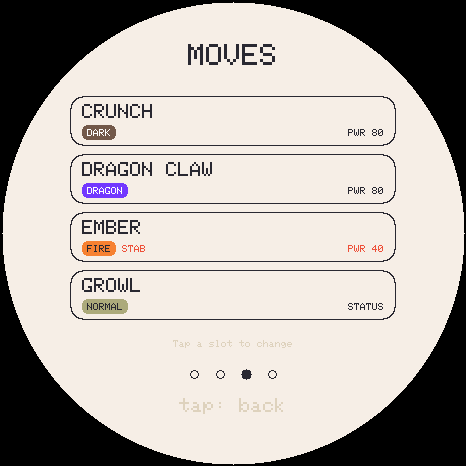 |

The egg carries a **region pill** — pick whether it hatches from Kanto, Johto,
Hoenn or all three. Switching keeps the rarity it was granted and remembers each
region's answer, so it cannot be flipped to farm a legendary.

### Battling

| The fight | Choosing a team | Winning |
|---|---|---|
| 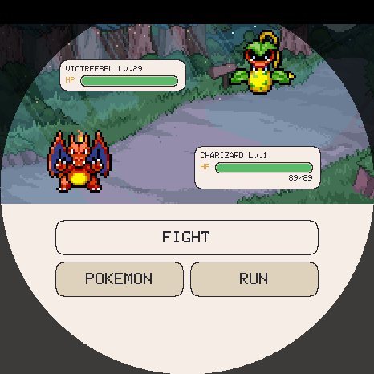 | 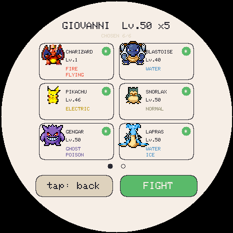 |  |

Turn- and move-based, with the real type chart, ailments and STAB. Real Game Boy
battle music plays throughout.

### Five regions

| Pick a ladder | Johto's gyms | LAN battle |
|---|---|---|
| 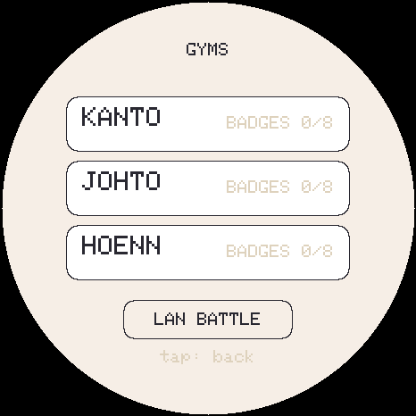 | 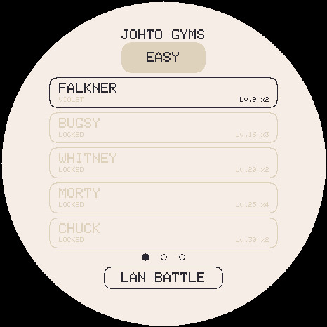 | 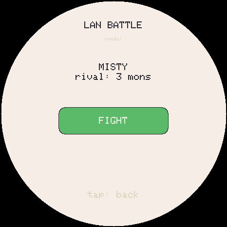 |

Kanto, Johto, Hoenn, Sinnoh and Unova each have eight leaders, an Elite 4 and a
champion, on easy and hard. Four of the five are the games' own teams, checked
against the pokecrystal, pokeemerald and pokeplatinum disassemblies -- **0
differences across all 39 trainers**, re-checkable with
`tools/verify_rosters.py`.

**Unova is the exception and says so.** pret has no Gen 5 disassembly, so that
ladder is written from knowledge rather than from the game's own tables;
`verify_rosters.py` prints it as NOT VERIFIED rather than letting a clean run
imply otherwise. It follows Black 2 / White 2, which unlike Black/White has no
version- or starter-dependent leaders.

Sinnoh follows **Platinum**, where Fantina is the *third* gym rather than
Diamond/Pearl's fifth; the level ramp only runs 14/22/26/32/37/41/44/50 that
way. Same reasoning that makes Hoenn Emerald throughout.

### Collecting

| Pick a region | Kanto | Johto |
|---|---|---|
| 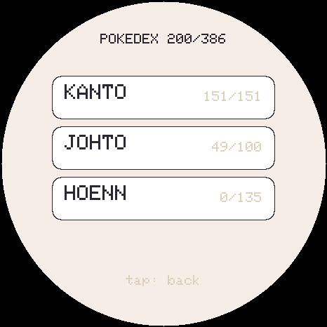 | 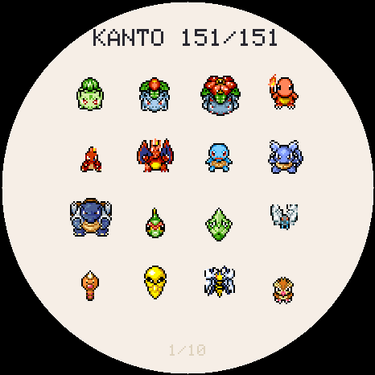 | 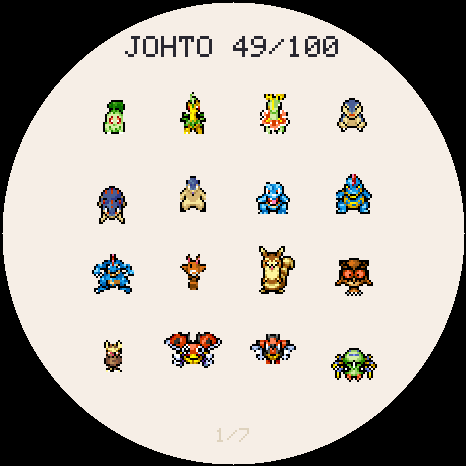 |

| Trainer card | Johto badges | The box |
|---|---|---|
|  |  |  |

## Status

Running on hardware. Implemented: 386 species + shinies animated from microSD, full
life cycle (egg by rarity → evolution → farewell/release/runaway, each gated
behind a decision dialog), bred-Pokédex with gallery, battle stats (IVs +
training), retention hooks (streak / bond / medals / name), biome + real-time
backgrounds, ball minigame, training bag, animated bath, RTC with offline
progression, battery (AXP2101) and PWR button, anti-burn-in dimming,
**sound (ES8311)**, **6 UI languages (English default)**, **starter choice on
first run**, and a one-click **web installer**.

Pending: wild encounters / battle (designed, not implemented), 3D case, soak
test. See **Roadmap**.

## Game manual (the actual numbers)

A quick reference to how the game really works (values straight from the code).

### Time & leveling
- **1 real minute = 1 in-game minute.** Your Pokémon gains **+1 level every hour**
  of real time. Leveling is purely time-based — caring well doesn't speed it up,
  but neglect *delays evolution*.
- **Level caps at 100**, reached at 4 days 3 hours. Farewell is only *offered* at
  3 days (level 73) — **not a deadline**: your Pokémon is still growing, and
  declining it to reach 100 is a real choice. Declining re-offers a day later.
- It keeps **aging while powered off** (the RTC runs), catching up to **2 weeks** max.

### The four stats (0–100)
Needs: **FOOD**, **JOY**, **ENE** (energy), **HYG** (hygiene). Start 80 / 80 / 80 / 100.
While **awake**, per minute:

| Stat | Drain/min | Notes |
|---|---|---|
| FOOD | −2 | |
| ENE | −1 | −1 extra if overweight (weight > 50 → sluggish) |
| HYG | −1 | **−4 more per poop** on screen (max 3 poops) |
| JOY | −1 | **−2 extra** if FOOD < 30, **−2 extra** if HYG < 30 |

- ~**15 %/min** chance to poop (only if FOOD > 40). Poops tank hygiene fast.
- **Care slip-up** = letting any stat hit **≤ 10** (60-min cooldown so it counts once).
  Each slip-up **delays evolution by 1 level** and cools the bond by 1.

### Actions
- 🍎 **Berry** (3 flavors): +25 FOOD. Each species has a **hidden favorite flavor**
  → +35 FOOD, +10 JOY, ♥, bond, and it gets revealed.
- 🍬 **Candy:** +10 FOOD, +12 JOY, but **+12 weight** (fattening).
- ⚽ **Ball game:** **+5 JOY, plus 2 per rally** (max +35), −ENE, burns weight.
  Trains **DEFENSE** (~2 hits = 1 pt, cap +18/session) — freed up for this once
  SPEED got its own reaction test. Leaving early keeps what you earned.
- 🎯 **Reaction test:** a target appears, tap it before it shrinks away. Trains
  **SPEED**; the window tightens as you go.
- 🥊 **Training bag:** trains **STRENGTH** (~4 hits = 1 pt, cap +18/session), tires it.
- 🫐 **Berry-catch:** catch falling berries before they hit the ground. Trains
  **VIT** (~3 catches = 1 pt, cap +18/session).
- ❓ **Who's That Pokémon? quiz** (menu page 2): a 25-second silhouette round,
  4 multiple-choice options. **+4 JOY plus up to +26** on a streak — pure
  happiness, no stat trains and no energy/hygiene/weight cost, since answering
  trivia is not exercise. Reached from the menu's second page, next to RETIRE.
- 📖 **RSVP speed reader** (menu page 2): flashes a loaded `.txt` book one word
  at a time at an adjustable words-per-minute rate (100–800, ±50 a tap).
  Remembers where you left off across sessions. A pure utility — no stat or
  joy rides on it. See "Loading books for the RSVP reader" above for getting
  a book onto the card.
- 🫧 **Bath:** clears poops, HYG → 100.
- 👆 **Pet it:** +5 JOY + bond.
- 🌙 **Sleep:** rest — ENE **+6/min**, needs drain ~**4× slower** with floors
  (FOOD 30 / JOY 35 / HYG 45). No poops, no slip-ups, can't run away while asleep.
  **Screen off + between midnight and 06:00 puts it to sleep**, and it stays
  asleep until you turn the screen back on -- it wakes when *you* do, not at a
  fixed hour. Re-checked every minute, so a device put down at 23:00 nods off
  when midnight comes. The
  evening is deliberately outside the window -- a six-hour night is the only part
  of the day you are not expected to be around. The light
  button beats both: a creature you sent to bed stays there.

### Eggs & who you get (spawn odds)
- **First ever pet:** you pick a starter — **Bulbasaur / Charmander / Squirtle**.
- Hatch the egg: tap it **3×** (or wait — it hatches on its own).
- Every later egg rolls a **rarity tier** (over the ~79 base forms that come from eggs):

| Tier | Base chance | After a proper goodbye | # species |
|---|---|---|---|
| ✨ Legendary | ~3 %\* | ~10 % | 5 |
| 🔵 Rare | ~27 % | ~45 % | 27 |
| ⚪ Common | the rest | the rest | 47 |

  \* Legendaries only start appearing once you've **registered ≥ 25** Pokémon.
- A daily **streak** and high **bond** push rare/legendary odds higher.
- A clean **goodbye blesses** the next egg; a **run-away curses** it (forces Common).
- Within a tier it favors species whose **evolution line you haven't finished** (so
  all 386 are completable).
- **Shiny:** base **1 / 48** (→ **1 / 24** right after a goodbye), improved by
  streak/bond down to a best of **1 / 8**. Tracked separately in the dex.
- Every hatch rolls unique **IVs** (see below) — no two are identical.

### Evolution

**Cross-generation evolutions are linked.** When the dex reached 386 the targets
arrived but nothing connected them, so six Kanto species could not evolve into
creatures that were sitting right there in the Pokedex: GOLBAT -> CROBAT,
ONIX -> STEELIX, CHANSEY -> BLISSEY, SEADRA -> KINGDRA, SCYTHER -> SCIZOR and
PORYGON -> PORYGON2. Those six now evolve (friendship pairs at 25, trade pairs
at 40), and the six targets stopped hatching straight from eggs -- rarity is
derived from being somebody's evolution, so they became evolution-only the way
every other evolved form already was.

`gen_dex_data.py --link` is the rule rather than a one-off edit: it fills in any
evolution whose target has since joined the table, and only ever touches rows
whose value is 0, so it cannot retune an evolution anybody already has. Sinnoh
brings ELECTIVIRE, MAGMORTAR and RHYPERIOR waiting on exactly the same thing.

- Triggers when **level ≥ its evolution level** (16 for most base forms; ~30 for
  stone-style, ~40 for trade-style) **and every stat ≥ 40** at that moment.
- **Never automatic** — a button appears and **you tap to witness it** (with a
  flicker between the old and new form). Each **slip-up delays it by 1 level**.
- You can **decline** ("keep form"); it re-offers at the next level.
- *Eevee* branches toward whichever of its **eight** evolutions you're still
  missing — Vaporeon, Jolteon, Flareon, Espeon, Umbreon, Leafeon, Glaceon and
  Sylveon. None of the eight hatches from an egg any more: the only way to a
  Sylveon is to raise an Eevee. A branch is offered only if that region's
  sprite pack is on the card, so evolving can never hand you a creature the
  device cannot draw.

### Your party
- A **farewell** or a **release** doesn't end the relationship any more — the creature
  **joins your party** (5 slots), keeping its species, nickname, shiny status, IVs,
  training and the level it reached. Frozen there: it no longer ages or trains.
  Five, not six: together with the active creature that's a full team of 6 --
  exactly the battle cap, so team-select never has to leave anyone out.
- A **runaway does not join.** It's the one ending with a cost, and letting a
  neglected pet come back on the team would remove it. **Neither does an early
  retire** — see "Retiring a creature early" below.
- **Letting one go for good.** Tap a party or box slot to open its sheet;
  **RELEASE** removes that creature permanently. It asks first, every time, and
  the creature does not fall through into the box — this is the one way to free
  a slot without something taking its place. A box slot now opens the same sheet
  rather than jumping straight into the party, and **TO PARTY** does that.
- With a full party you're taken straight to the party screen to pick who the
  newcomer replaces — or to let it go. Nothing is ever overwritten silently.
- **Changing who's active.** Tap a party slot's sheet: while an egg is waiting,
  **BRING BACK** makes that banked creature your companion again — but it stays
  **frozen** at the level it was banked, never ageing or evolving further. While
  you already have a live creature, the same button instead reads **SWITCH**:
  it trades places with your current one on the spot, no ceremony, no egg. The
  incoming creature keeps going exactly like the one it replaced — it can still
  evolve, farewell, retire or run away from here — and the one it replaced is
  banked in its place, so nothing is lost either way. **FOOD/JOY/ENE/HYG,
  weight, poops and the neglect clock travel WITH each creature** rather than
  resetting on the swap — a starving, neglect-clocked pet comes back exactly
  as starving as it left, so switching is never a free refill.
- *(Gym battles, which is what the party is for: on the roadmap.)*

### The three endings (you choose & witness each — none auto-fire)
- 💛 **Farewell** — when it's a **final form** that has lived **3 days**. A button
  appears; triggering it **blesses your next egg**. You can **postpone** ("stay
  together", re-offered in a day). The good ending.
- 💔 **Run-away** — if you let **all four stats sit at 0 for a full hour**. A single
  act of care cancels it. It **curses the next egg** (forces Common). The sad ending.
- 👋 **Release** — long-press the creature to let it go on your terms (neutral).

After any ending, a **new egg** appears.

### Bonds, streaks, medals, Pokédex
- **Streak** (player-wide, survives across pets): first care each real day; milestones
  at **3 / 7 / 30 / 100** days; skipping a day breaks it.
- **Bond** (per pet, resets on hatch): grows with affection (**cap +20/day**), cools on
  neglect. Both streak & bond improve egg/shiny odds — **and the IVs of your next pet**.
- **8 medals** (Lv10/25/50, favorite berry found, 7-day streak, max bond, final form,
  "fit" = weight 0 & no slip-ups), per-pet + a global counter.
- **Pokédex:** raising a species registers it; **809 + shinies** to complete.
  Browsed **one region at a time** — swipe vertically between regions,
  horizontally to page within it, so nothing is more than ten pages from the front.
- **Region:** the pill under a waiting egg picks which generation it comes from —
  **Kanto / Johto / Hoenn / Sinnoh / Unova / Kalos / Alola / All**. A first egg gives that
  region's starter. A handful of species have no sprite art anywhere (13 of
  Unova's 156, and Pyroar); they keep their dex numbers but never hatch, since the egg would
  give a creature that could only ever draw as a number.
  A region whose **sprite pack is not on the card** shows as locked and is kept
  out of the egg pool, so a partial sprite install is a supported state. A pack
  sent from the web installer is picked up **as it lands** — the region unlocks
  without a reboot.

### Battle stats & IVs
Every pet rolls four **IVs** (individual values, 0–31) at hatch — ATK / DEF / SPD /
VIT — that never change and make each one genuinely unique:

```
stat = base + level + (IV × level)/100 + training
```

The `(IV × level)/100` term is the **real formula from Gen III onward** — a perfect
IV is worth +31 at level 100. But IVs do a second job here that they don't do in
the games: **they cap training.**

| | Effect |
|---|---|
| Innate bonus | up to **+22** at level 73 (end of a normal life) |
| Training ceiling | `70 + (30 × IV)/31` → **77** at IV 8, **100** at IV 31 |
| Total spread | ~**40 points**, about **15 %** between a great and a poor individual |

- **Rolls are 8–31, never 0.** In the real games a 0 IV is survivable because you can
  breed hundreds of eggs; here a pet lives 3 days, so a dud would just be a punishment.
- **Streak + bond bias the roll upward** (up to +7) — using the *previous* pet's care
  score. Raising one well genuinely improves the next.
- **Legendaries hatch with 3 of 4 IVs perfect**, exactly as they're guaranteed 3
  perfect IVs in the games.
- **Shinies floor every IV at 20** — a nod to Gen 2, where shininess *was* a DV
  pattern and a shiny was never mediocre.
- IVs are shown on the Battle page of the stat card; a perfect 31 is highlighted.

Training: **STRENGTH** ← the bag, **SPEED** ← the reaction test, **DEFENSE** ← the
ball game (and still 1 h of wellbeing passively), **VIT** ← the berry-catch game.
All four live in the training menu (2 pages); the ball moved off the home row when
it became defence's trainer. VIT used to bake in a flat +10 in place of a real
training term — everyone's vitality quietly started ahead of the other three
stats, which had to be earned from zero. It now starts at 0 like the rest.

**TMs unlock at level 40**, all of them, and nothing before. A TM carries no level
requirement in the data — true of the games, wrong here, because a young creature
has few level-up moves and the spare slots were filled with the strongest TMs in the
table. A **level 1 Squirtle opened with SURF and BLIZZARD and could beat Brock.**

One number rather than a curve: the first five leaders sit at **14–43**, so you
fight the early ladder on what your species actually learns, and TMs arrive as you
enter the back half. A creature retires at 73 and caps at 100.

That only works because the move table now carries the **cheap early attacks** —
SCRATCH, PECK, POISON STING, BUBBLE, ABSORB, SPARK, FURY ATTACK and the rest. Before
them, ~15 % of species reached level 15 with no attacking move at all and were
quietly leaning on TMs to fill the gap.

**Gym wins train too**, which is what makes the ladder worth replaying rather than
a checklist you tick once:

### Wild encounters

**WILD** is on the menu's first page (row 4 -- it swapped places with RETIRE,
which is now on the second page), and starts a one-off fight against a random
creature from your current region -- always **common rarity**, never an
evolution-only or legendary species, and never shiny. Its level is rolled near
your own live pet's (`level ± 3`, clamped to 1–100): not gym-capped, since a
wild fight is not part of the badge ladder.

The battle menu gains a fourth option, **BAG**, which opens the Pokeball,
Masterball and Potion -- see "Inventory & expeditions" below for where those
come from. Choosing a ball throws it. The catch chance depends on the wild
creature's remaining HP, and a Masterball adds a flat bonus on top:

| Wild HP | Catch chance (Pokeball) | Catch chance (Masterball) |
|---|---|---|
| Full | **15 %** | **50 %** |
| Near fainting | **85 %** | **100 %** (capped) |
| (linear in between) | `15 + 70 × (missing HP / max HP)` | `+35`, capped at 100 |

A Masterball **raises** the odds; it is not the mainline games' guaranteed
catch. Throwing either ball spends one from your inventory immediately, win or
lose -- with none of either left, both rows in the bag grey out. A miss
usually just costs the turn -- the wild creature gets to act, same as
switching -- but there is also a flat **20 %** chance (`CAPTURE_FLEE_PCT`) on
a miss that it flees outright instead, ending the fight for good. Both are
decided the instant the ball is thrown, not when the animation finishes.
A catch ends the fight immediately: the creature joins your **party** if
there is room, else the **box**, else you are dropped into the same
"choose who to replace" screen a farewell already uses when both are full.
Its IVs roll the same 8–31 spread (no care-streak bonus, and no legendary
guarantee — wild encounters are always common) a freshly hatched egg would.
It is also registered in the **Pokedex** the moment it is banked.

### Inventory & expeditions

The menu's third page holds **INVENTORY** (a read-only list of what you're
carrying) and **EXPEDITION** (send the active pet off to gather more). A new
save starts with **5 Pokeballs**, 0 Masterballs and 0 Potions -- an existing
save loading this for the first time gets the same courtesy 5, so an update
never leaves an established player unable to capture anything until their
first trip back.

An expedition takes the active pet away for a fixed duration; while it's
gone, feeding/playing/bathing/training and every minigame that touches it are
blocked (there's no pet on screen to do them to), but its hunger, energy,
hygiene and joy keep draining exactly as they would during any other stretch
without interaction -- an expedition is not a pause. A banked squad member can
still fight in your place while the active one is away. Longer trips bring
back more items, drawn from the same three-item table regardless of length:

| Duration | Items brought back | Potion | Pokeball | Masterball |
|---|---|---|---|---|
| 15 min | 2 | 40 % | 45 % | 15 % |
| 30 min | 4 | 40 % | 45 % | 15 % |
| 1 hour | 7 | 40 % | 45 % | 15 % |

A **Potion**, used from the battle bag, heals a fixed **40 HP** on whichever
creature is currently on the field -- not a percentage, and it does nothing
outside a fight (HP itself is never carried between battles; see the battle
section below). Using it spends the turn, same as switching or a failed
capture: the opponent still gets to act.

Winning any trainer or wild fight also trains **every squad member that took
at least one turn**, not just the active pet -- a banked member who fought
gets the same random ATK/DEF/SPE bump (still capped by its own IVs, same as
the active pet's), and there's a flat **30 %** chance of an extra item on top
(`BTL_LOOT_PCT`, same three-item table as an expedition). A link (LAN) battle
grants neither: the squad it fights with is rebuilt from what was already
shipped to the peer, with no safe way back to a party slot index, so it keeps
its older behaviour of no reward at all.

### Retiring a creature early

The farewell is only *offered* at final form and three days. **RETIRE** on the
menu ends a creature whenever you like -- but what that costs depends entirely
on whether the farewell had been earned yet.

| | |
|---|---|
| Retiring one that has **earned** its farewell | free -- it is simply the farewell reached by another button. It **joins your party** and **blesses** the next egg |
| Retiring one that has **not** | it is **gone for good** -- not banked, not in the box -- the next egg is **neutral** instead of blessed, and the **next** creature evolves a day later |

An early retire used to bank the creature and bless the next egg exactly as a
farewell does, which made it the good ending with a small tax on it: you could
retire, check the egg, and retire again, farming blessed rolls at no real cost.
Giving the creature up is the price now, and the confirm dialog spells out both
halves before you accept.

The penalty is `EVO_PENALTY_LEVELS` (24 at `MINUTES_PER_LEVEL 60`) added to
every evolution threshold, the same sum `careMistakes` moves. It lands on the
creature that hatches next, is spent by hatching it, and does **not** compound:
three early retires in a row still cost one day. The creature's card says
"evolves a day later" while it carries the debt, and the confirm dialog says the
price before you accept it.

### Choosing your egg's region

The species is decided when the egg **appears**, not when it cracks, so changing
region moves the egg you are holding. Two rules stop that being a re-roll button:

| | Rule |
|---|---|
| Rarity | the tier the egg was granted is **kept** — only which species of that tier changes, so flipping can never fish for a legendary |
| Memory | each region's answer is **remembered** for the current egg, so switching back shows the same creature |

The region is first chosen at the **very start of a new game**, on the screen
before the starter -- so the creature you begin with and the eggs that follow
come from the same place. Everything below is about changing it afterwards.

A region is decided by the **base** species, and evolutions follow wherever they
lead — a Kanto run still reaches Crobat and Blissey.

| | Training a win is worth |
|---|---|
| Easy | **3–5** points, **+1 per 3 leaders** deeper into the ladder |
| Hard | **6–10** points, same ladder bonus |
| Which stat | **random**, but only among stats **not already at their ceiling** |
| Who gets it | the **live pet**, and only if it was in the squad |

A random stat that landed on a maxed one would silently evaporate, so it never
picks one; and the IV-bound ceiling above still applies, so a win can never push a
stat past what its IV allows. Banked members are frozen at what they were banked
with, and battling already costs the live pet energy — that, not a cooldown, is
what rate-limits rematching. A fully trained creature is told so.

## Hardware

- Board: [ESP32-S3-Touch-AMOLED-1.75](https://www.waveshare.com/wiki/ESP32-S3-Touch-AMOLED-1.75)
  — get the **Standard** (no case) or **-G** (GPS, also fits) version; **not the "-B"**
  (ships with a protective case that won't fit). The separate "1.75**C**" is a different board.
- Round 466×466 AMOLED, **CO5300** driver (QSPI, 80 MHz)
- Capacitive touch **CST9217** (I2C, address 0x5A)
- **AXP2101** (power management + battery + PWR button), **PCF85063** (RTC),
  microSD slot, **ES8311** audio codec (→ amplifier → external speaker on the
  MX1.25 connector)
- Pins taken from the [official Waveshare repo](https://github.com/waveshareteam/ESP32-S3-Touch-AMOLED-1.75) (see `pin_config.h`)

## Libraries (Arduino IDE / arduino-cli)

| Library | Author | Use |
|---|---|---|
| GFX Library for Arduino (`Arduino_GFX`) | moononournation | CO5300 over QSPI + framebuffer in PSRAM |
| SensorLib | Lewis He | CST9217 touch + PCF85063 RTC |
| XPowersLib | Lewis He | AXP2101 PMU (battery, brightness, PWR button) |
| ESP_I2S (bundled in the ESP32 core) | Espressif | I2S to the ES8311 codec |

## IDE setup / build

- Board: **ESP32S3 Dev Module** · Flash **16MB** · PSRAM **OPI PSRAM**
  (required: the 466×466×16-bit framebuffer ≈ 434 KB lives in PSRAM) ·
  Partition Scheme with FAT (e.g. `16M Flash (3MB APP/9MB FATFS)`) ·
  USB CDC On Boot **Enabled**

```bash
FQBN="esp32:esp32:esp32s3:CDCOnBoot=cdc,FlashSize=16M,PSRAM=opi,PartitionScheme=app3M_fat9M_16MB"
arduino-cli compile --fqbn "$FQBN" .
arduino-cli upload -p /dev/cu.usbmodemXXXX --fqbn "$FQBN" .

# or just, which finds the port itself and can open the console:
bash tools/flash.sh --monitor
```

### Run it on your computer

`tools/emu/` compiles the **real firmware** — `TamaPoke.ino`, `pet.cpp`,
`i18n.cpp`, `party.cpp`, unmodified — into a clickable desktop app, stubbing only
the hardware. Click to touch, drag to swipe, type serial commands in the
terminal, and `--fast 60` runs a whole 3-day life in about an hour.

```bash
brew install sdl2          # Debian: apt install libsdl2-dev
bash tools/emu/build.sh
tools/emu/tamapoke-emu --scale 2 --fast 60
```

There's a headless `--shot` mode for screenshots too. See
[`tools/emu/README.md`](tools/emu/README.md). It won't tell you anything about
timing, DMA tearing, PSRAM or audio — those still need the board.

### Easiest install: the web installer

`web/index.html` flashes the firmware (ESP Web Tools) and pushes the sprites to
the SD over Web Serial, no Arduino needed. Serve it over HTTPS or `localhost`
(secure context) and open it in **Chrome/Edge**. See [`web/README.md`](web/README.md).

### Generate and load the sprites yourself

All sprites come from **[PMD SpriteCollab](https://github.com/PMDCollab/SpriteCollab)**
(CC BY-NC). You can regenerate the whole set and load it onto your board with the
pipeline below — the firmware accepts files over USB (PUT protocol with per-block
ACK), so you don't have to remove the card (it formats the SD to FAT if needed).

```bash
python3 tools/pack_pmd.py       # fetch + pack PMD sprites: 386 + shiny -> tools/sdcard/mons/p[s]NNN.bin
python3 tools/make_thumbs.py    # Pokédex thumbnails (from the PMD sprites) -> thumbs.bin
python3 tools/send_sd.py        # send tools/sdcard/mons/* to the board's SD over USB
```

To make the **one-click web-installer bundle** instead of sending over USB:

```bash
python3 tools/pack_bundle.py    # bundle tools/sdcard/mons/* into web/sprites.pak
```

Then load it from the web installer's **"Load sprites"** button (or `send_sd.py`
above). `pack_pmd.py` also takes individual dex numbers, e.g. `pack_pmd.py 7 25`.
(~40 MB total, all PMD. Versioned under `tools/sdcard/`.)

### Loading books for the RSVP reader

The RSVP speed-reading minigame (menu → page 2 → READ) reads plain `.txt`
files from `/books` on the SD, streamed word by word rather than loaded whole
so a book's size is bounded only by the card, not by PSRAM. Load one or more
from the web installer's **"load .txt file(s)"** link (same USB connection as
the sprites, same PUT protocol) or with `send_sd.py`-style tooling by hand.
**Plain English/ASCII text only** — the bitmap font has no accented glyphs, so
anything else prints as `?`, same rule as every other firmware string.
[Project Gutenberg](https://www.gutenberg.org/) ("Plain Text UTF-8" download)
is a good source of free, public-domain books.

## How to play

On first run you **choose a starter** (Bulbasaur / Charmander / Squirtle). After
that you start with an **egg**. Tap it 3 times or wait and it hatches. From then
on, care for your companion:

**Four stats** that decay: **FOOD**, **JOY**, **ENE** (energy), **HYG** (hygiene).
If one bottoms out it counts as a *slip-up*.

**Buttons (bottom arc, icons):**
- 🍎 **Feed** → food menu: 3 berries (each species has a hidden favourite that
  gives a bonus) and a candy (+happiness but it fattens; weight makes it sluggish).
- ⚽ **Play** → the pokeball minigame (joy only).
- 🌙 **Light** → sleep/wake (recovers energy, dims the screen). While asleep,
  needs decay much slower (rest).
- 🫧 **Bath** → a foam scene that cleans up the poops.

**Touch gestures:**
- **Tap the name** at the top = the **menu** (Stats / Inventory / Settings /
  Wild battle on the first page, Retire / Pokédex on the second). Close it
  with the CLOSE row, by tapping anywhere outside the panel, or with any swipe.
- Tap the creature = pet it (+happiness, bond).
- Horizontal swipe = open the **Pokédex / gallery**.
- Vertical swipe up = open the **stat card** (4 pages: Profile / Battle / Medals /
  Progress; swipe between them; tap the name on Profile to rename; on Battle the
  "Train strength" button opens the bag).
- Swipe down = **set the clock** and pick the **language** + sound on/off.
- Long press (3 s) on the creature = **release** dialog.

**Physical PWR button:** short = screen on/off · long (4 s) = full power-off
(the RTC stays alive, so time passes even while it's off).

## Decisions: you choose, and you watch

The three life-cycle endings and evolution **don't happen on their own** — when
the conditions are met a button appears and you tap it (so you're present to
witness it), each opening a two-option dialog:

- **Evolution** (red button): *Evolve* (epic animation: halo, rays, sparkles and
  a **flicker between the old and new form**) or *Keep form* (re-offered next level).
- **Farewell** (gold button, final form + 3 days): *Say goodbye* (warm farewell,
  rising hearts → new egg) or *Stay together* (keep your companion; re-offered in
  a day). Tension: a maxed-out friend vs. completing the Pokédex.
- **Runaway** (dark button, total neglect for 1 h): a somber "feels abandoned"
  ending in the rain — caring for the creature cancels it.

  **It does not ask, and that is the point** -- a creature you have to authorise
  to leave is not really at stake. What it must never be is the price of going
  to bed, so **the screen being off between midnight and 06:00 puts the creature to
  sleep**, and sleep floors the stats at FOOD 30 / JOY 35 / HYG 45 with the
  neglect check skipped entirely. A night costs you a hungry, grubby creature at
  breakfast instead of an empty one.

  **Both halves are needed.** The screen alone would pause the game every time
  you pocketed the device, and the creature is meant to get hungry during the
  day. The hour alone would send it to bed while you were still playing. Set the
  clock in **SETTINGS** (or `RTCSET`); a board whose clock was never set simply
  never auto-sleeps, which fails safe -- it keeps draining and the light button
  still works by hand.

  This was a real loss: a player left the board running overnight and came back
  to a Dratini that had gone. The live tick was the only drain path with no
  floor -- offline floors at 15, sleep at 30/35/45 -- so a board left *running*
  was punished where a board switched *off* was not. `night_test` runs ten
  simulated hours and fails if that ever comes back.

## Sprites: PMD SpriteCollab everywhere

- **PMD SpriteCollab** (everything — main screen, stat card, minigame **and the
  Pokédex grid + detail view**): behaviour sprites — `tools/pack_pmd.py` packs
  actions (Idle, Walk L/R, Sleep, Eat, Hurt, Attack, Pose, Nod, DeepBreath) into
  the multi-action **TPK2** format (`/mons/pNNN.bin`). The engine in `TamaPoke.ino`
  makes the creature wander, gesture, curl up to sleep, chew and wince. Anchored by
  the feet (lowest content row), not the canvas. The Pokédex thumbnails
  (`thumbs.bin`, TPTH) are derived from these by `tools/make_thumbs.py`.
- **In-house workshop** (`tools/sprites.py`): 9 primitive-drawn sprites as a
  no-SD fallback + the UI icons. Generates `species.h`. Preview in
  `tools/sheet.png`, emit with `python3 tools/sprites.py emit`.

`sdmon.h/.cpp` loads the PMD sprites into PSRAM (`PmdMon` for TPK2) plus the
thumbnails (`SdThumbs`). `SdMon` (TPK1) remains as a dormant legacy fallback only.

## Pokédex and species data

`tools/dex_data.py` is the **single source**: name, slug, type (accent colour +
background biome), evolution line with gen-1 levels, rarities and starters.
`tools/dex_stats.py` has the base stats and `tools/dex_types.py` the typings and
type chart (both from PokéAPI). Note these are **current** values, not Gen 1 ones —
Pidgeot has 101 Speed here, not the 91 it had in Red/Blue. `gen_dex.py` emits
`dex.h` (the `DEX_TBL[152]` table). The pet's identity is its Pokédex number
(persisted in NVS).

- **Evolution** gen-1 style (levels 16/36/…; stones ≈30, trade ≈40; Eevee
  branches to whichever evolution you're missing). Each slip-up delays it 1
  level; it won't evolve with any stat < 40 or while asleep.

## Types

Every species carries its real **typing** (one or two of the 18 types) and the game
ships the full **18×18 effectiveness chart** — `dex.h` holds both, generated from
`tools/dex_types.py`.

The chart is the **current (Gen 6+) one, not Gen 1's**, which is a deliberate call:

- Gen 1's chart shipped real bugs — Ghost moves did literally nothing to Psychic —
  and Psychic was resisted only by Psychic, so it ran away with every fight.
- The base stats here were **already** pulled from PokéAPI at current values, so
  modern stats with an ancient chart was the inconsistent pairing.
- **Fairy earns its keep:** Dragonite has the highest Attack in the dex, and before
  Gen 6 Dragon was resisted only by Steel. Dragon → Fairy is **0×**, so Clefable
  hard-walls the strongest thing you can hatch.

Seven of the original 151 differ from their Gen 1 typing: Magnemite and Magneton gained Steel
(Gen 2), and Clefairy, Clefable, Jigglypuff, Wigglytuff and Mr. Mime gained Fairy
(Gen 6) — the first two losing Normal entirely.

Typing is shown on the Battle page of the stat card. *(Battles: on the roadmap.)*

## Battle stats and training

Each creature has ATK/DEF/SPD/VIT = **base stat** + level + **IV** (0–31, rolled
at hatch, `IV × level/100` exactly as in the real games) + **training**:
- SPEED ← the **reaction test** (~2 reactions = 1 pt, cap +18 per session)
- DEFENSE ← the **ball game** (~2 hits = 1 pt, cap +18 per session), plus
  accumulated wellbeing (1 h resting or well-cared = +1)
- STRENGTH ← the training bag (~4 hits = 1 pt, cap +18 per session)
- VIT (vitality, from the base HP stat) ← the **berry-catch game**
  (~3 catches = 1 pt, cap +18 per session)

### Moves

Each creature knows up to **4 moves**, from a pool of 77. Two kinds:

- **Level-up moves** are gated: Charizard learns FLAMETHROWER at 34, WING ATTACK
  at 36, DRAGON RAGE at 54. A hatchling starts with **only** what its species
  knows at level 1 — a Charmander opens with GROWL alone, and the other three
  slots stay empty. Crossing a gate fills an empty slot silently; with all four
  full you get a **prompt** asking which to forget (or to skip it). Offers queue,
  so coming back to a pet that aged two weeks offline asks one at a time.
  Evolving keeps the moves it already has, and the new form's gates take over —
  moves it would have learned *below* your current level are not backfilled,
  same as the real games.
- **TMs** have no level gate and are chosen on demand, from the **MOVES** page of
  the stats card (swipe across, then tap a slot).

Levels come from FireRed/LeafGreen, the Kanto games that still gate properly.
A move that is *also* a TM keeps its level gate — otherwise every gated move
would come free, since most of them were sold as TMs at some point.

Moves **freeze when a pet is banked** into the party, alongside its level and
training: the set you chose while it was alive is what it fights with forever.

**Special attack and defence** come off the species' own `bSpA`/`bSpD` base stats
(Alakazam is 50 Attack but 135 Special Attack), reusing the physical IV and
training rather than rolling their own: special attack runs off the ATK IV and
training, special defence off the DEF IV and training. So the physical/special
split lives on the species, not the individual — no extra IVs to roll.

The IV also sets **how far each stat can be trained at all** (77–100), so a
well-rolled individual has a genuinely higher ceiling, not just a head start.
See [Battle stats & IVs](#battle-stats--ivs) for the numbers.

Shown on the Battle page of the stat card. The (hidden) weight goes up with candy
and burns off with training.

## Retention: streak, bond, medals, name

- **Streak** (the player's, persists across creatures): the first care of each
  real day advances the streak; 3/7/30/100 milestones are celebrated; skipping a
  day breaks it. Flame badge on the main screen.
- **Bond** (the creature's): rises slowly with care and petting, drops with slip-ups.
- **Medals** for the individual (level, berry, streak, bond, final form, fit) +
  a global counter. Medals page of the stat card.
- **Name**: touch keyboard; the nickname rules the header and the card.

High streak and bond **improve the egg roll** (rarity and shiny): caring well
always pays off.

## Life cycle, eggs by rarity, languages

The life cycle lasts **3 days** of play. Three endings (all leave a new egg):
**farewell** (final form + 3 days), **release** (long press), **runaway** (all 4
bars at zero for 1 h). Each bred species is recorded in the **bred Pokédex**
(normal and shiny separately).

The egg rolls rarity over the ~79 base forms (47 common / 27 rare / 5 legendary),
**biased towards the lines you're missing** (all 386 are completable), blessed by
a farewell and punished by a runaway. Legendaries only with 25+ registered.
**Shiny** 1/48 (better with streak/bond/farewell).

**Languages:** the UI ships in 6 languages — English (default), Spanish, French,
German, Italian, Portuguese — switchable from the settings screen (swipe down).
Species names are localized for dex 1–386 in all six; the table was never
extended through the later Sinnoh/Unova expansions, so dex 387–809 falls back
to the canonical (English-derived) name in every language rather than showing
a blank or crashing.

## Backgrounds: biome + real time

The idle screen paints the sky from the **RTC's real time** (dawn / day / dusk /
night with moon and stars) and the ground from the **type's biome** (meadow,
beach, forest, volcano, mountain, snow). Sleeping forces night.

## Layout

- `TamaPoke.ino` — init, game loop, render of every screen, gestures, serial console, audio
- `pet.h` / `pet.cpp` — pet state and logic (stats, evolution, life cycle, streak/bond/medals, NVS)
- `party.h` / `party.cpp` — the 5 retired pets kept from farewells and releases
- `sdmon.h` / `sdmon.cpp` — TPK1 (animated) and TPK2 (PMD) sprites + thumbnails, and file reception over USB (PUT/LS)
- `rtcbat.h` / `rtcbat.cpp` — PCF85063 RTC + AXP2101 PMU (battery, brightness, PWR button)
- `audio.h` / `audio.cpp` — ES8311 + I2S + Game-Boy-style tone synth (non-blocking task)
- `i18n.h` / `i18n.cpp` — the 6-language string tables
- `dex.h` — GENERATED (`gen_dex.py`): the 386 table
- `species.h` — GENERATED (`sprites.py`): fallback sprites, UI icons, colours
- `pin_config.h` — the board's official pins
- `tools/` — pipeline: `dex_data.py` (data), `dex_stats.py`, `dex_types.py`, `gen_dex.py`,
  `sprites.py` (workshop), `pack_pmd.py` / `make_thumbs.py`
  (packers), `pack_bundle.py` (web bundle), `send_sd.py` (SD upload), `touch_log.py`
- `tools/emu/` — desktop emulator (real firmware + stubbed hardware, SDL)
- `tools/sdcard/mons/` — the generated .bin files (animated, shiny, PMD, thumbnails)
- `web/` — the browser installer (ESP Web Tools + Web Serial sprite loader)

## Serial console (115200, debug)

`STATS` (full state) · `SPEC <dex>` (change species) · `LVL <n>` ·
`IV <atk> <def> <spd> <vit>` (force individual values) · `HATCH` ·
`EGG <dex> [shiny]` (hatch a chosen species — the only way to test the
legendary/shiny IV guarantees, which apply at hatch) ·
`SHINY` · `NICK <x>` · `BYE` / `RUN` (farewell / runaway) · `ABANDON` (force the
runaway-ready state) · `WIPE` (factory reset → new game) · `BEEP` (audio test) ·
`REG` (Pokédex) · `EGGS` (simulate 20 eggs) · `GAL` (gallery) · `CAREDAY` ·
`PARTY` / `PARTY <dex>` / `PARTY CLEAR` (inspect and fill the party) ·
`TIME <epoch>` / `RTCSET <epoch>` · `HEALTH` (uptime + heap for the soak test) ·
`LS` / `PUT` (SD files).

To test fast: lower `PET_TICK_MS`, `MINUTES_PER_LEVEL` and `FAREWELL_AGE_MIN` in `pet.h`.

## Roadmap

- **Wild encounters / battle** — designed (see project memory): resolution by
  ATK/DEF/SPD with PMD Attack/Hurt animations, trainer rank as endgame. Style
  still to pick (auto / timing / turn-based).
- **Soak test** 24–48 h (instrumentation ready: `HEALTH` command/heartbeat).

*(Done: 3D-printed case [published on MakerWorld](https://makerworld.com/es/models/2937822-tamapoke-a-pokemon-pokeball-tamagotchi); repo public with the browser installer + one-click sprite bundle.)*

## Community forks

- **[TamaPoke — Expanded](https://github.com/ShadowEnemyx/TamaPoke/tree/tamapoke-expanded-update)** by **ShadowEnemy** — a substantial community fork (different author/branch): a full **type-matchup battle system**, all **151 + shinies** with a **Pokédex / collection box** and daily goals, **6 UI languages**, **ES8311 sound**, starter choice and a one-click web installer. Worth a look. 🎮

## Credits

All sprites: [PMD SpriteCollab](https://github.com/PMDCollab/SpriteCollab)
(community, CC BY-NC). Base stats: [PokéAPI](https://pokeapi.co). Pokémon is a ™ of
Nintendo / Game Freak / The Pokémon Company. Non-commercial, personal-use project.
Full list in [`CREDITS.md`](CREDITS.md).

## License

- **Source code** (firmware + tooling): **[MIT](LICENSE)**.
- **Sprites & names**: © Nintendo / Game Freak / The Pokémon Company; pixel art
  from [PMD SpriteCollab](https://github.com/PMDCollab/SpriteCollab) (CC BY-NC 4.0).
  **Non-commercial use only.**
- **3D-printed case**: remix of *"Pokeball"* by **yoyothechicken**
  ([MakerWorld #839922](https://makerworld.com/es/models/839922-pokeball)),
  licensed **CC BY-NC-SA**, and shared here under the same terms.

This is an unofficial fan project, not affiliated with or endorsed by Nintendo.
